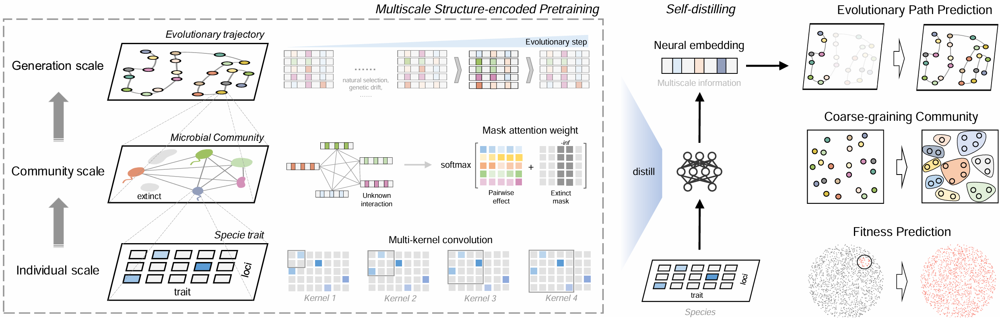

# Multiscale structure-encoded pretraining

A python implementation of our manuscript "*Multiscale structure-encoded pretraining for modeling evolutionary microbial communities*”.

This work introduces a unified, self-supervised pretraining framework to model the complex dynamics of evolutionary microbial communities. Evolution unfolds across individual (species traits), community (species interactions), and generational (temporal sequences) scales, creating high-dimensional and stochastic processes that are challenging to analyze.



This repository contains the source code for preprocessing data and reproducing experimental results. The source code is implemented in Python.

<br/>

## Installation Guide

- Install Anaconda https://docs.anaconda.com/anaconda/install/index.html

- Create an experimental environment and install request packages: (this will take about 0.5 hours)

  ```shell
  conda create --name ecopretrain python=3.9
  conda activate ecopretrain
  pip install omegaconf tqdm scikit-learn torchdiffeq torch
  ```

<br/>

## Data

- **Landscape**: The `Landscape/data` folder provides the original data, preprocessing scripts, and processed data for the three experimental adaptive landscape systems discussed in the manuscript:
  - E. coli toxin-antitoxin system 
  - Saccharomyces cerevisiae transfer RNA (tRNA) system 
  - Entacmaea quadricolor fluorescent protein system 
- **MacArthur**: The `MacArthur/` folder provides the simulation scripts and data preprocessing code for the resource competition model, adapted from the framework developed by Tikhonov et al.
- **Coli**: The `Coli/data` folder provides the original data, preprocessing scripts, and processed data for the real-world *E. coli* laboratory evolution system with multi-antibiotic resistance.

<br/>

## Experiments

This repository provides the source code for all experiments in the main text and supplementary materials. The specific scripts are organized as follows:

- `Landscape/`: Contains the experimental scripts to reproduce **Figures 2, 3, and 4** of the main text and **Supplementary Figure 2**.
- `MacArthur/`: Contains the experimental scripts to reproduce **Figure 5** of the main text and **Supplementary Figure 1**.
- `Coli/`: Contains the experimental scripts to reproduce **Figure 6** of the main text.

<br/>

## Acknowledgments

The real-world and simulated datasets used in this paper were collected and adapted from the following open-source studies and projects: 

- [CCU](https://www.nature.com/articles/s41586-018-0170-7#Sec27): *Saccharomyces cerevisiae* tRNA system
- [eqFP611](https://www.nature.com/articles/s41467-019-12130-8#data-availability): *Entacmaea quadricolor* fluorescent protein system
- [ParD3](https://elifesciences.org/articles/60924): *E. coli* toxin-antitoxin system
- [MacArthur](https://journals.aps.org/prx/abstract/10.1103/PhysRevX.12.021038): Resource-competition model
- [E. Coli](https://journals.plos.org/plosbiology/article?id=10.1371/journal.pbio.3001920): Multi-antibiotic resistance *E. coli* evolution experiment.

<br/>

## License

This repo is covered under the **MIT License**.
